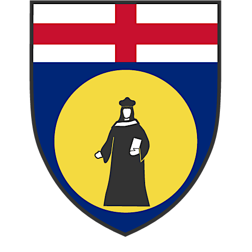

# &nbsp; UniGe Informatica (triennale)

Unige Sito - https://unige.it/en   
Manifesto Degli Studi - https://servizionline.unige.it/unige/stampa_manifesto/MF/2023/8759.html  
Pagina Corso - https://corsi.unige.it/corsi/8759   
Insegnamenti - https://corsi.unige.it/corsi/8759/insegnamenti/   

## **Italiano:**  
Benvenuti nella mia repository dedicata alla programmazione universitaria presso l'Università di Genova! Qui troverete una raccolta di esami passati e materiali di esercizio per affrontare al meglio gli argomenti trattati nei corsi della laurea triennale. Questa repository contiene una serie di esercizi e librerie utili per consolidare le vostre competenze nel campo della programmazione. Spero che questi materiali vi aiutino nel vostro percorso accademico e nello sviluppo delle vostre abilità di programmazione.

**Inglese:**  
Welcome to my repository dedicated to university programming at the University of Genoa! Here you will find a collection of past exams and exercise materials to help you tackle the topics covered in the bachelor's degree courses. This repository contains a series of exercises and libraries aimed at strengthening your programming skills. I hope these materials assist you in your academic journey and in developing your programming abilities.
