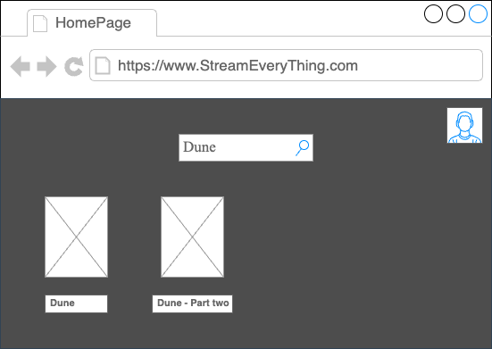

# Caso d'Uso: Ricerca Nel Catalogo
## Breve Descrizione: Permette la ricerca del catologo di film/serire TV
## Attori primari: Utenti
## Attori secondari: Nessuno
## Precondizioni: L'utente deve aver raggiunto il sito web(o l'applicazione). Il sistema deve essere operativo e raggiungibile.
## Sequenza degli eventi principale:
1. L'utente seleziona la funzionalità "Ricerca Nel Catalogo"
2. Il sistema chiede al cliente i criteri di ricerca (ad esempio inserisci il titolo)
3. L'utente inserisce i criteri di ricerca e conferma
4. Il sistema ricerca i film/serie TV che corrispondono ai criteri di ricerca immessi dall'utente 
5. Fintantochè i criteri di ricerca non sono validi 

    5.1 Il sistema chiede di ri-inserire i criteri

    5.2  L'utente inserisce i criteri di ricerca 

    5.3  Il sistema valida i criteri inseriti

6. Il sistema ricerca i film/serie TV che corrispondono ai criteri di ricerca immessi dall'utente
7. Se il sistema trova uno o più film/serie TV

    7.1 Il sistema mostra il catalogo
    
    
8. Altrimenti 

    8.1 Il sistema comunica che non sono stati trovati film/serie TV
## Postcondizioni: L'utente visualizza il contentuo desiderato
## Sequenze alternative: UtenteAnnullaRicerca

---------------------------------------------------------------------------------------------------------------------------------------------------------------------------------------------------------------------------------------------------

# Caso d'Uso: Login
## Breve Descrizione: Permette all’utente registrato di autenticarsi nel sistema.
## Attori primari: Utente registrato
## Attori secondari: Google, Facebook
## Precondizioni: L’utente deve essere già registrato nel sistema. Il sistema deve essere operativo e raggiungibile
## Sequenza degli eventi principale:
1. L’utente seleziona la funzionalità “Login”

2. Il sistema mostra la schermata di accesso, chiedendo e-mail e password oppure l'accesso con Google/Facebook
3. L’utente inserisce le proprie credenziali e conferma l’operazione
4. Il sistema verifica la correttezza delle credenziali fornite
5. Se le credenziali sono valide: 

    5.1 Il sistema autentica l’utente 

    5.2 Il sistema mostra la homepage personalizzata dell’utente registrato (base o premium, a seconda del tipo di account) 

    5.3 L’utente può ora accedere alle funzionalità riservate del proprio profilo

6. Altrimenti 

    6.1 Il sistema comunica che le credenziali sono errate 
## Postcondizioni: L'utente risulta autenticato e può accedere alle funzionalità corrispondenti al proprio profilo (base o premium)
## Sequenze alternative: EmailNonValida, PasswordNonValida, Annulla